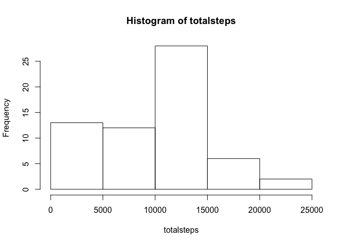
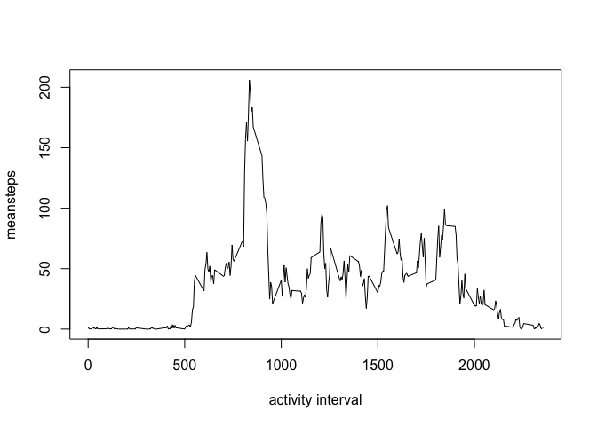
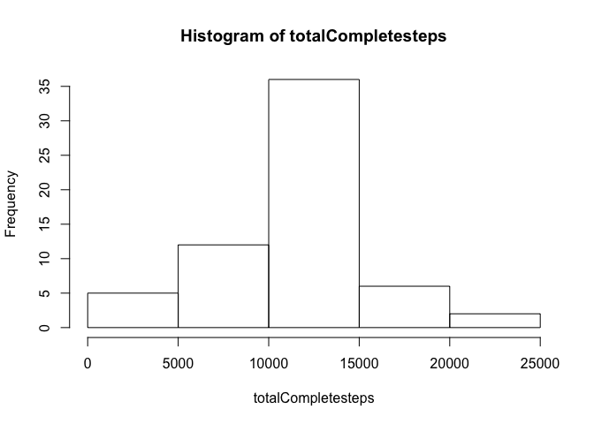
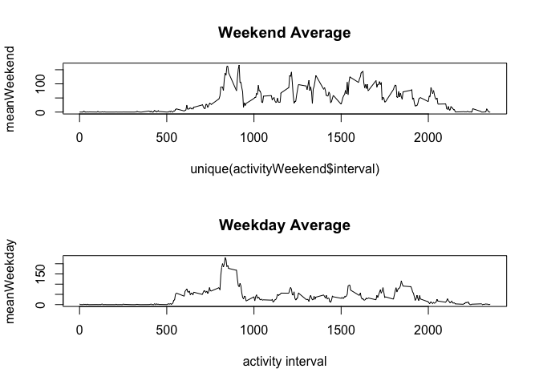

# Reproducible Research: Peer Assessment 1


## Loading and preprocessing the data


```r
## download the file and store in the current working directory
setwd('~/Documents/datasciencecoursera/Reproducible/RepData_PeerAssessment1')
download.file("https://d396qusza40orc.cloudfront.net/repdata%2Fdata%2Factivity.zip","./activity.zip")
## unzip("./activity.zip")
activity <- read.csv('activity.csv')
activity$date <- as.Date.factor(activity$date)
totalsteps <- tapply(activity$steps, activity$date, sum, na.rm=T)
hist(totalsteps)
```

 

## What is mean total number of steps taken per day?


```r
mean(totalsteps)
```

```
## [1] 9354.23
```

```r
median(totalsteps)
```

```
## [1] 10395
```

## What is the average daily activity pattern?


```r
meansteps <- tapply(activity$steps, activity$interval, mean, na.rm=T)

plot( unique(activity$interval), meansteps, xlab="activity interval" , type="l")
```

 

## Imputing missing values

```r
## number of missing (NA) values
sum(is.na(activity$steps))
```

```
## [1] 2304
```

```r
activityComplete <- activity

## assign the mean for the interval for any missing values
for (i in 1:length(activityComplete$interval)) 
{ 
      if (is.na(activityComplete$steps[i]))
        {
        activityComplete$steps[i]<-mean(activityComplete$steps[activityComplete$interval==activityComplete$interval[i]], na.rm=T)
        }
}

sum(is.na(activityComplete$steps))
```

```
## [1] 0
```

```r
totalCompletesteps <- tapply(activityComplete$steps, activity$date, sum, na.rm=T)
hist(totalCompletesteps)
```

 

```r
mean(activityComplete$steps)
```

```
## [1] 37.3826
```

```r
median(activityComplete$steps)
```

```
## [1] 0
```
The median and mean do not change when the missing values are estimated, but it does make the histogram more symmetrical.


## Are there differences in activity patterns between weekdays and weekends?

```r
weekend <- function(x) 
{
        if (weekdays(x) %in% c('Sunday', 'Saturday'))
        {
                return("Weekend")
        }
        else
        {
                return("Weekday")
        }
 }


for (d in 1:length(activityComplete$date)){
        activityComplete$weekend[d] <-weekend(activityComplete$date[d])
}

activityComplete$weekend <-as.factor(activityComplete$weekend)

activityWeekend <- subset(activityComplete, activityComplete$weekend=="Weekend")
activityWeekday <- subset(activityComplete, activityComplete$weekend=="Weekday")

meanWeekend <- tapply(activityWeekend$steps, activityWeekend$interval, mean, na.rm=T)

meanWeekday <- tapply(activityWeekday$steps, activityWeekday$interval, mean, na.rm=T)

par(mfrow=c(2,1) ,xlab="activity interval")
```

```
## Warning in par(mfrow = c(2, 1), xlab = "activity interval"): "xlab" is not
## a graphical parameter
```

```r
plot( unique(activityWeekend$interval), meanWeekend,  type="l", main="Weekend Average")
plot( unique(activityWeekday$interval), meanWeekday, xlab="activity interval" , type="l", main="Weekday Average")
```

 

